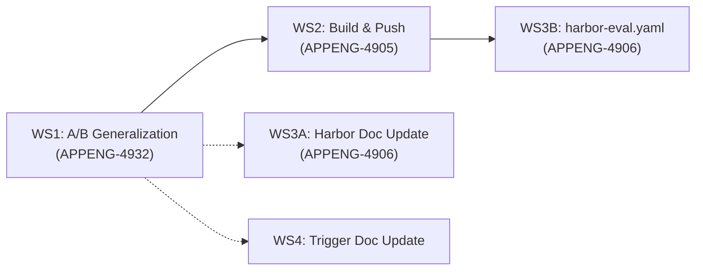

# Workstreams Roadmap

> Last updated: 2026-04-14

## Overview

Four workstreams to complete the ABEvalFlow pipeline. WS1 is the critical path — it renames skilled/unskilled to treatment/control across the codebase and adds the A/B experiment framework.

---

## Current State (2026-04-14)

| Item | Status |
|------|--------|
| PR #1 — Phase 1 validation (APPENG-4903) | Merged |
| PR #2 — Tekton triggers + validate task (APPENG-4903) | Merged |
| PR #3 — Phase 2 scaffolding (APPENG-4904) | Merged |
| PR #4 — Rename to ABEvalFlow | Merged |
| Branch `APPENG-4905/phase-3-build-push` | Stale — forked from `c98b547`, missing PRs #1-4. Abandoned. |
| Harbor OpenShift backend (`skills_eval_corrections`) | Feature-complete in fork, unit tested |

---

## WS1: A/B Eval Flow Conversion (APPENG-4932)

**Branch:** `APPENG-4932/ab-eval-flow-conversion`
**Plan:** [ab_testing_generalization_plan.md](./ab_testing_generalization_plan.md)

Refactor the pipeline from hardcoded "skilled vs unskilled" to a general "treatment vs control" A/B framework. Skills remain the default experiment type. Adds support for model, prompt, and custom experiment types via a strategy pattern.

### Execution Steps

See the detailed commit plan in [ab_testing_generalization_plan.md](./ab_testing_generalization_plan.md).

| Step | Commit | Key files | Tests |
|------|--------|-----------|-------|
| 1 | Schema: `ExperimentConfig`, `VariantSpec`, `CopySpec` | `abevalflow/schemas.py` | `tests/test_validate.py` |
| 2 | Strategy pattern | `abevalflow/experiment.py` (new) | `tests/test_experiment.py` (new) |
| 3 | Scaffold refactor | `scripts/scaffold.py` | `tests/test_scaffold.py` |
| 4 | Template unification | `templates/Dockerfile.j2` (new), delete old | existing tests cover |
| 5 | Tekton YAML renames | `pipeline/tasks/scaffold.yaml` | N/A (YAML only) |
| 6 | Docs + README terminology | `implementation_plan.md`, `README.md` | N/A |

---

## WS2: Build & Push (APPENG-4905)

**Branch:** `APPENG-4905/build-push-treatment-control` (to be created after WS1 merges)
**Depends on:** WS1 merged

Recreate the build-push Tekton task from scratch on current `main` using treatment/control naming. The old `APPENG-4905/phase-3-build-push` branch is abandoned — it diverged from `c98b547` (before PRs #1-4) and would require a conflict-heavy rebase with no benefit.

### What to build

- `pipeline/tasks/build-push.yaml` — Buildah-based build and push for treatment/control images
  - Params: `treatment-task-dir`, `control-task-dir`, `skill-name`, `commit-sha`, `registry-url`, `registry-namespace`
  - Results: `treatment-image-ref`, `control-image-ref` (digest-based)
  - Steps: `build-push-treatment`, `build-push-control` (rootless Buildah, `--storage-driver=vfs`)
  - Image tags: `:treatment-<sha>`, `:control-<sha>`
  - Namespace: `ab-eval-flow`
- `config/rbac.yaml` — RoleBinding for `system:image-builder` in `ab-eval-flow` namespace
- Update `Docs/implementation_plan.md` — Phase 3 checkboxes

### Reference

The old branch had a working `build-push.yaml` (109 lines) that can be used as a starting point, just with renamed params/results/steps and updated namespace.

### Cleanup

After this merges, delete the old `APPENG-4905/phase-3-build-push` branch (local and remote).

---

## WS3: Harbor Backend (APPENG-4906)

### WS3A: Harbor Handoff Doc Update

**Can run in parallel** with any workstream.

Update [harbor_openshift_backend.md](./harbor_openshift_backend.md) to match the actual implementation in `src/harbor/environments/openshift.py`:

| Doc says | Reality | Action |
|----------|---------|--------|
| File: `openshift_environment.py` | `openshift.py` | Fix filename |
| `_build_and_push_image` is no-op only | Supports pre-built (`image_ref`) AND podman build | Document both modes |
| `readOnlyRootFilesystem: true` | Intentionally unset (many workloads need writes) | Update security section |
| RBAC: ConfigMaps, Secrets, ImageStreams | Only Pods + exec used | Narrow RBAC table |
| skilled/unskilled terminology | treatment/control after WS1 | Update naming |

### WS3B: harbor-eval.yaml Tekton Task

**Depends on:** WS2 merged (needs image ref handoff)

New `pipeline/tasks/harbor-eval.yaml` in ABEvalFlow:
- Params: `treatment-image-ref`, `control-image-ref`, `n-trials`, `namespace`
- Runs `harbor run --env openshift --ek image_ref=<ref> --ek namespace=<ns>`
- Collects results to workspace/PVC

### Investigation needed before WS3B

Verify Harbor's CLI interface for trial count: `--runs`, `--n-trials`, config-based, or passed via `task.toml`. Check `harbor/cli/tasks.py` for the `--ek` help text.

---

## WS4: Trigger Doc Update

**Can run in parallel** with any workstream.

Update [trigger_models_and_experiment_types.md](./trigger_models_and_experiment_types.md) based on discussion with Daniele Martinoli (2026-04-14):

### Changes

1. **Option 1 stays primary** — standalone submission repo (to be created, e.g. `RHEcosystemAppEng/ab-eval-submissions`)
2. **Clarify "ephemeral"** — the git submission is persistent as a git artifact, but it's not the final destination; it's an evaluation request. For skills there is code to contribute, but for agent/model/MCP comparisons the output is a decision (env var change, configuration), not a code contribution
3. **Option 2 enhancement — hybrid approach** — GH Action triggered by a PR label from admins, calling the same pipeline. The eval platform just needs the gitops submission repo to run, no matter how it's created. Skill-admins control their own trigger policy
4. **Admin-gating** — not all developers should trigger evaluations; admin label/approval gates the pipeline. This is on the skill-owner side, separate from the eval platform
5. **Two-role separation** — skill-admin (controls trigger policy, labels PRs) vs eval-platform (runs the pipeline from the submission repo)
6. **Non-code experiments** — agent compare, model compare, MCP eval are env-var/config changes, not repo contributions — reinforces why Option 1 is the natural universal fit

### Scope

Documentation update only. No code changes. The submission repo trigger (Option 1) is what we build. The PR-based hybrid (Option 2) is acknowledged and designed for, but not implemented now.

---

## Execution Order

1. **WS1** — A/B generalization (branch exists, start coding)
2. **WS4** — trigger doc update (can be done during WS1 PR review)
3. **WS3A** — harbor doc update (can be done during WS1 PR review)
4. **WS2** — build-push with treatment/control naming (after WS1 merges)
5. **WS3B** — harbor-eval.yaml task (after WS2 merges)

## Jira Tickets

| Ticket | Workstream | Status |
|--------|------------|--------|
| APPENG-4932 | WS1: A/B Eval Flow Conversion | In progress |
| APPENG-4905 | WS2: Build & Push Images | Blocked on WS1 |
| APPENG-4906 | WS3: Harbor OpenShift Backend | Partially done (fork complete, doc + Tekton task remain) |
| (none yet) | WS4: Trigger Doc Update | Not started |
